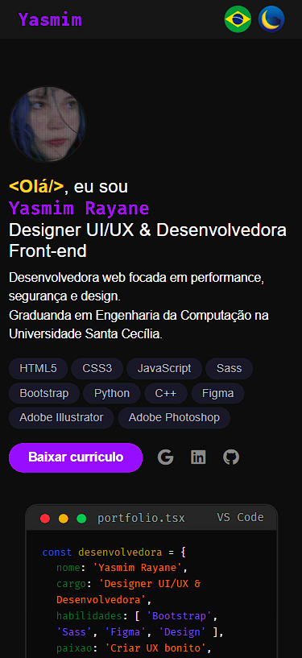
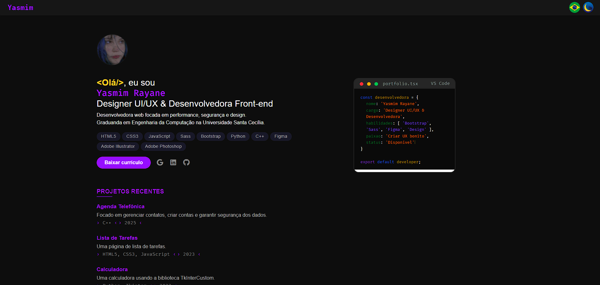
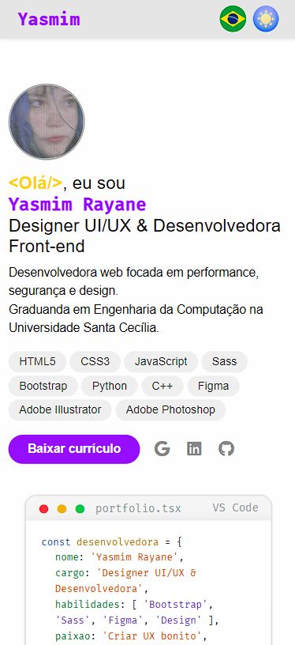
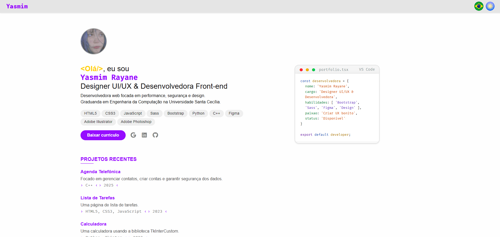

<h1 align="center">Portfólio Pessoal - Front-End</h1>

<p align="center">
  
  
  
  
</p>


---

## Sobre o Projeto

Este projeto foi desenvolvido como trabalho final da disciplina **Tecnologia Web** do curso de Engenharia da Computação da Universidade Santa Cecília. Consiste em um portfólio pessoal responsivo que apresenta informações profissionais, projetos desenvolvidos e canais de contato.

**Acesso:** [https://yasmim-rayane.github.io/portfolio-front-end-final/](https://yasmim-rayane.github.io/portfolio-front-end-final/)

### Fases de Desenvolvimento

O projeto foi estruturado em duas etapas principais:

- **Parte 1 (Semana 5):** Prototipagem no Figma e estruturação semântica em HTML5
- **Parte 2 (Semana 11):** Implementação de responsividade, interatividade com JavaScript e deploy automatizado

### Diferenciais Técnicos

- Pipeline CI/CD completo com GitHub Actions
- Versionamento semântico automático
- Testes automatizados de código
- Deploy contínuo no GitHub Pages
- Suporte offline com Service Worker

---

## Funcionalidades

### Interface e UX

- [x] Layout responsivo (mobile-first design)
- [x] Tema claro e escuro alternável
- [x] Suporte bilíngue (português e inglês)
- [x] Animações CSS customizadas
  - Estrelas cadentes no modo escuro
  - Nuvens flutuantes no modo claro
- [x] Navegação suave entre seções

### Conteúdo e Integração

- [x] Seção "Sobre Mim" com apresentação pessoal
- [x] Portfólio de projetos com descrições detalhadas
- [x] Integração com GitHub API para exibir repositórios
- [x] Formulário de contato funcional (Formspree)
- [x] Download de currículo em PDF
- [x] Links para redes sociais

### Funcionalidades Técnicas

- [x] Service Worker para cache e funcionamento offline
- [x] Web Manifest para instalação como PWA
- [x] Compilação automática de SASS
- [x] Lazy loading de imagens
- [x] SEO otimizado

---

## Stack Tecnológica

### Front-End


### Frameworks e Bibliotecas


### Ferramentas e Serviços


---

## Arquitetura do Projeto

```
portfolio-parte1/
├── .github/
│   ├── workflows/              # Pipelines CI/CD
│   │   ├── beta-ci.yml        # Testes automatizados (branch beta)
│   │   ├── main-deploy.yml    # Deploy automático (branch main)
│   │   └── pr-check.yml       # Validação de pull requests
│   ├── SETUP.md               # Guia de configuração CI/CD
│   └── README.md              # Documentação dos workflows
├── assets/
│   ├── config/
│   │   ├── sw.js              # Service Worker
│   │   └── site.webmanifest   # Manifest PWA
│   ├── css/
│   │   ├── style.css          # Folha de estilos compilada
│   │   └── header-effects.css # Animações do header
│   ├── sass/                  # Arquivos fonte SCSS
│   │   ├── style.scss         # Arquivo principal
│   │   ├── _tokens.scss       # Variáveis de design
│   │   ├── _themes.scss       # Temas claro/escuro
│   │   ├── _effects.scss      # Animações
│   │   └── _translation.scss  # Estilos de tradução
│   ├── script/
│   │   ├── script.js          # Lógica principal
│   │   ├── theme.js           # Sistema de temas
│   │   ├── translation.js     # Sistema de tradução
│   │   ├── api-github.js      # Integração GitHub API
│   │   └── shooting-stars.js  # Animação de estrelas
│   ├── images/                # Assets visuais
│   │   ├── icons/             # Ícones do sistema
│   │   ├── cursor/            # Cursores customizados
│   │   └── screenshots/       # Capturas de tela
│   └── docs/
│       └── Curriculo_Yasmim_Rayane.pdf
├── index.html                 # Página principal
├── .gitignore                 # Arquivos ignorados pelo Git
└── README.md                  # Este arquivo
```

---

## Protótipo

O design da interface foi previamente planejado utilizando Figma, garantindo consistência visual e experiência de usuário otimizada:

**[🎨 Visualizar protótipo completo](https://www.figma.com/proto/r6YEu3B7Mkz5T44HFqD08c/Portfolio-for-Web-Development?page-id=0%3A1&node-id=78-11601&viewport=874%2C-1136%2C0.5&t=JnigT85uKSAhLjnN-1&scaling=min-zoom&content-scaling=fixed&starting-point-node-id=78%3A11601)**

---

## Capturas de Tela

<div align="center">
  
  
  <br>
  
  
</div>

---

## Instalação e Execução

### Pré-requisitos

- Navegador web moderno (Chrome, Firefox, Edge, Safari)
- Git instalado
- Sass (opcional, apenas se for modificar os estilos)

### Executar Localmente

```bash
# Clone o repositório
git clone https://github.com/yasmim-rayane/portfolio-front-end-final.git

# Acesse o diretório do projeto
cd portfolio-front-end-final

# (Opcional) Se modificar os arquivos SASS, compile-os:
sass assets/sass/style.scss assets/css/style.css

# Abra o arquivo index.html no navegador
# Ou use um servidor local (recomendado):
# - VS Code: extensão Live Server
# - Python: python -m http.server
# - Node.js: npx http-server
```

### Instalação do Sass (se necessário)

```bash
# Via npm
npm install -g sass

# Via Chocolatey (Windows)
choco install sass

# Via Homebrew (macOS)
brew install sass/sass/sass
```

---

## Pipeline CI/CD

O projeto implementa automação completa com GitHub Actions:

### Branch `beta` (Desenvolvimento)

Executa workflow de testes automatizados (`beta-ci.yml`):
- Compilação SASS
- Validação de sintaxe HTML
- Verificação de erros JavaScript
- Checagem de assets essenciais

### Branch `main` (Produção)

Executa workflow de deploy completo (`main-deploy.yml`):
1. Bateria completa de testes
2. Criação de tag de versão automática (Semantic Versioning)
3. Deploy no GitHub Pages
4. Publicação de Release Notes

### Pull Requests

Executa workflow de validação (`pr-check.yml`):
- Validação de código antes do merge
- Comentário automático com resultado dos testes
- Bloqueio de merge em caso de falha

**Documentação completa:** [.github/workflows/README.md](.github/workflows/README.md)

---

## Estrutura de Branches

```
main (produção)
  ↑
  │ Pull Request (validado automaticamente)
  │
beta (desenvolvimento)
```

- **`beta`**: Branch de desenvolvimento e testes
- **`main`**: Branch de produção (site publicado)

---

## Licença

Este projeto foi desenvolvido exclusivamente para fins educacionais como parte da disciplina Tecnologia Web do curso de Engenharia da Computação.

**Uso:** Acadêmico  
**Distribuição:** Permitida com atribuição  
**Modificação:** Permitida

---

## Autora

**Yasmim Rayane**  
Engenharia da Computação - Universidade Santa Cecília  

### Contato

<p align="center">
  <a href="mailto:silva.yasmimray@gmail.com" target="_blank">📧 E-mail</a> &nbsp;•&nbsp;
  <a href="https://github.com/yasmim-rayane" target="_blank">💻 GitHub</a> &nbsp;•&nbsp;
  <a href="https://www.linkedin.com/in/yasmimrayane" target="_blank">💼 LinkedIn</a>
</p>

---

<p align="center">
  <sub>Desenvolvido com dedicação durante o ano letivo de 2025/2026</sub>
</p>
