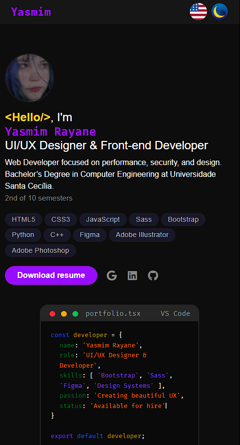
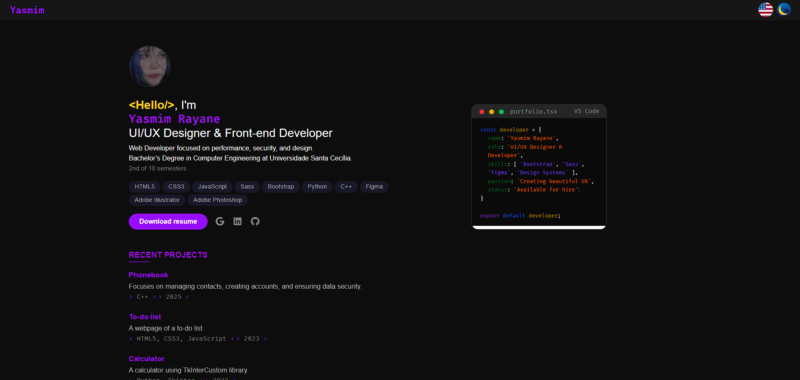

<h1 align="center" style="font-weight:700; font-size:2.5rem; letter-spacing:-1px;">Portfólio Pessoal - Front-End</h1>

Este é meu projeto final desenvolvido durante o curso <strong>Tecnologia Web - Engenharia da Computação (Front-End)</strong>. Trata-se de um site de portfólio pessoal com informações sobre mim, meus projetos e formas de contato.

<h2>Sobre o Projeto</h2>

Este site foi criado com foco em aplicar os conhecimentos de **HTML**, **CSS**, **JavaScript**, **Flexbox**, **responsividade** e **publicação com GitHub Pages**.

O projeto foi dividido em duas fases:
- **Parte 1 (Semana 5):** Estruturação HTML e protótipo no Figma  
- **Parte 2 (Semana 11):** Finalização com responsividade, interatividade e publicação online

<h2>Funcionalidades</h2>

    - [x] Página Sobre Mim com imagem e descrição
    - [x] Seção de Projetos com links e descrições
    - [x] Formulário de Contato com validação básica
    - [x] Layout responsivo (mobile e desktop)
    - [x] Animações e efeitos visuais com CSS
    - [x] Tema claro/escuro com JavaScript e CSS
    - [x] Idiomas inglês/português com JavaScript e HTML

## Tecnologias Utilizadas

<h3>Prototipagem e design</h3>

<h3>Corpo da página</h3>

<h3>Estilização e responsividade</h3>

<h3>API para o formulário do e-mail e publicação</h3>

<h2>Protótipo</h2>
Link para o protótipo criado no Figma:

[🔗 Ver protótipo](https://www.figma.com/proto/r6YEu3B7Mkz5T44HFqD08c/Portfolio-for-Web-Development?page-id=0%3A1&node-id=78-11601&viewport=874%2C-1136%2C0.5&t=JnigT85uKSAhLjnN-1&scaling=min-zoom&content-scaling=fixed&starting-point-node-id=78%3A11601)

<h2>Acesso ao Projeto</h2>

- **GitHub Pages:** [Clique aqui para acessar o site](https://yasmim-rayane.github.io/portfolio/)
- **Repositório GitHub:** [Acesse o código-fonte aqui](https://github.com/yasmim-rayane/portfolio)

<h2>Capturas de Tela</h2>

    
    

<h2>Licença</h2>

    Este projeto é de uso educacional, criado como parte da disciplina Tecnologia Web.

<h2>Desenvolvido por</h2>

**Nome completo:** Yasmim Rayane da Silva Nonato. 
**RA:** 252825. 
**Turma:** A (matutino do segundo semestre).

    <a href="mailto:silva.yasmimray@gmail.com" target="_blank">E-mail</a> &nbsp;|&nbsp;
    <a href="https://github.com/yasmim-rayane" target="_blank">GitHub</a> &nbsp;|&nbsp;
    <a href="https://www.linkedin.com/in/yasmimrayane" target="_blank">LinkedIn</a>

